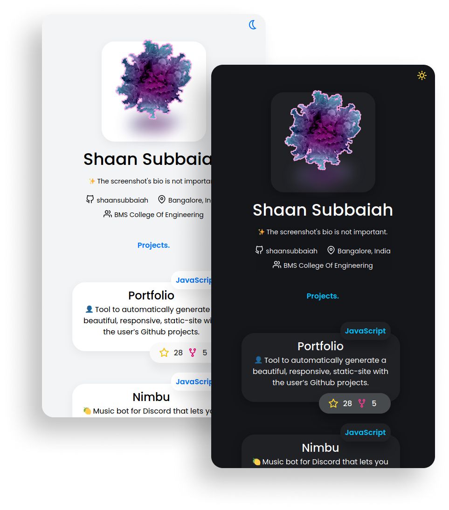
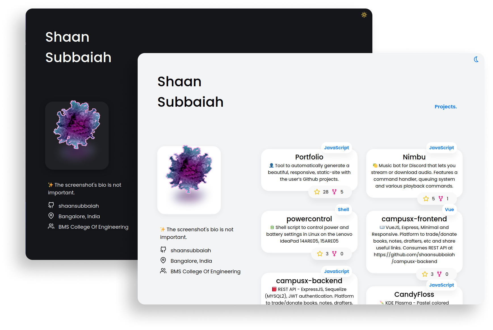

<div align="center">
    
    <br>
    Live demo at <a href="https://shaansubbaiah.github.io">shaansubbaiah.github.io</a>
    <br>
    
    <br>
    
</div>

If you find Portfolio useful, make sure to 🌟 the repository and spread the word!

## Getting Started

### Install

1. Download and extract the [latest release](https://github.com/shaansubbaiah/Portfolio/releases)

2. Install dependencies

```bash
npm install
```

3. Run Portfolio

```bash
node portfolio.js
```

4. Set the Github token, edit the config and then build!

> See [Configuration](#configuration)

> A token can be created at https://github.com/settings/tokens/new

> Make sure you have selected atleast **public_repo**, **read:user** permissions while creating the token!

**Done!** Copy contents in the _dist_ folder to your github pages repository.
Eg. your-username.github.io

## Configuration

**username**: String - your Github username

**repos**: Integer - number of repositories to display, **MAX 100**

**avatar**: String - path(local/remote) to an image for the avatar and favicon. If not specified, uses your GitHub avatar.

**linkedinURL**: String - your LinkedIn profile link. Set to _null_ in config.json to disable it / press <kbd>enter</kbd> while setting it up.

**twitterId**: String - your Twitter profile id. Set to _null_ in config.json to disable it / press <kbd>enter</kbd> while setting it up. (Portfolio will automatically get your Twitter ID if you have added it to your GitHub profile)

**gitlabId**: String - your GitLab profile id. Set to _null_ in config.json to disable it / press <kbd>enter</kbd> while setting it up.

**navLinks**: Object Array - adds navigation links at the top. **DON'T EXCEED 3**

    where,
    name: String - Text to display
    link: String - URL the text links to

**infoLinks**: Object Array - adds additional links in the information section

    where,
    name: String - Text to display
    link: String - URL the text links to

## Contributing

See [CONTRIBUTING.md](CONTRIBUTING.md)

[](https://sourcerer.io/fame/shaansubbaiah/shaansubbaiah/Portfolio/links/0)[](https://sourcerer.io/fame/shaansubbaiah/shaansubbaiah/Portfolio/links/1)[](https://sourcerer.io/fame/shaansubbaiah/shaansubbaiah/Portfolio/links/2)[](https://sourcerer.io/fame/shaansubbaiah/shaansubbaiah/Portfolio/links/3)[](https://sourcerer.io/fame/shaansubbaiah/shaansubbaiah/Portfolio/links/4)[](https://sourcerer.io/fame/shaansubbaiah/shaansubbaiah/Portfolio/links/5)[](https://sourcerer.io/fame/shaansubbaiah/shaansubbaiah/Portfolio/links/6)[](https://sourcerer.io/fame/shaansubbaiah/shaansubbaiah/Portfolio/links/7)

## Related

[Gitfolio](https://github.com/imfunniee/gitfolio)

[Dev Portfolio](https://github.com/RyanFitzgerald/devportfolio)

## License

[MIT](LICENSE) Copyright (c) 2020 Shaan Subbaiah
